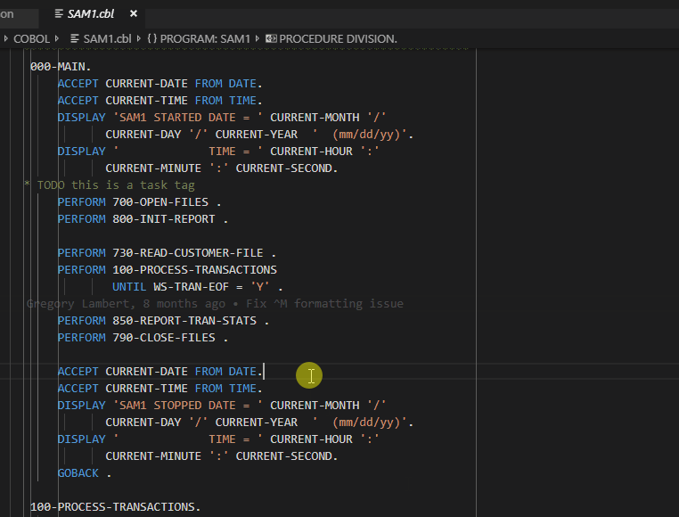
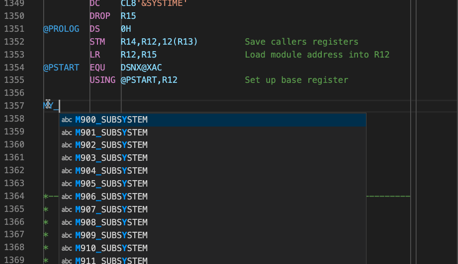
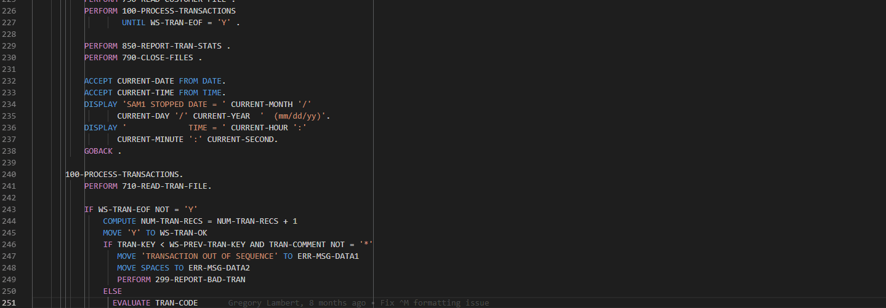

# License

- The license for the [IBM Z Open Editor](https://marketplace.visualstudio.com/items?itemName=IBM.zopeneditor), [IBM RSE API Plugin for Zowe CLI](https://www.npmjs.com/package/@ibm/rse-api-for-zowe-cli) that get attached to release items in this repository, as well as our [ZAPP nodejs library](https://www.npmjs.com/package/@ibm/zapp-core) can be found in the [product-licenses](./product-licenses/) folder in this repository. You can use this repository to file issues for the IBM Z Open Editor as well.
- The files managed in this repository contain files for presenting the <https://ibm.github.io/zopeneditor-about/> Web site, issues, discussion items, as well as the samples that can be found in these folders (except for the folder `product-licenses` and the attachments of our release items) that are used for tutorials. The license for these files you can find in the file [LICENSE](./LICENSE).

# IBM Z® Open Editor

**IBM Z Open Editor is an extension for Visual Studio Code that provides language support for the IBM® Enterprise COBOL, PL/I, HLASM, REXX, and JCL languages.**

> Go here for the full [Documentation](https://ibm.github.io/zopeneditor-about/Docs/introduction.html?utm_source=vscode&utm_medium=referral&utm_campaign=vscode_marketplace) online.

**Note, Z Open Editor version 3 has some breaking changes that require manual migration steps. See this dedicated [user documentation page](https://ibm.github.io/zopeneditor-about/Docs/zopeneditor_v3.html) for details.**

This extension provides language support for the IBM Enterprise programming languages for z/OS®. It supports COBOL v6.4, PL/I v6.1, and High Level Assembler for z/OS 2.5 and TSO/E REXX. This also includes capabilities for embedded statements in COBOL and PL/I for CICS 6.1, IMS 15.1.0 and SQL DB2 for z/OS 12.1. Earlier versions of any of these components will also work.

IBM Z Open Editor realizes its language support by implementing fully functional [language servers](https://langserver.org/) together with additional editor enhancements that enable IBM Z developers to utilize features such as:

- Real-time syntax checking and highlighting while you type
- Problems view with all syntax errors and (in COBOL) unreachable code
- Outline view and outline search
- For both variables and paragraphs:
  - Declaration hovers
  - Peek definition
  - Go to definition
  - Find all references
- Code and variable completion
- Finding and navigating references
- Previewing of included copybooks and include files as well as assembler macros
- Navigate to copybook and include file sources
- Refactoring such as "rename symbol"
- Custom code snippet support and more than 200 high value code snippets for COBOL, PL/I, and JCL out of the box
- Search and replace refactoring across multiple program files

Note, that the current early releases for HLASM and REXX only support a subset of the capabilities available for COBOL and PL/I. For the Job Control Language (JCL), the extension only provides syntax highlighting.

To learn more about the IBM Z Open Editor extension's capabilities, we suggest that you walk through our [documentation](https://ibm.github.io/zopeneditor-about/Docs/introduction.html) and try it with the [example repository](https://github.com/IBM/zopeneditor-sample) provided on GitHub.

To interact with z/OS, this extension also automatically co-installs the [Zowe Explorer](https://marketplace.visualstudio.com/items?itemName=Zowe.vscode-extension-for-zowe) VS Code Extension. This extension can be used to edit COBOL, PL/I, HLASM, REXX, and JCL files opened on z/OS MVS™ and USS using the Zowe extension's Data Sets and USS views. It can even run JCL jobs via right-click and let's you download and browse job spool files. Note, that since Z Open Editor version 2.0.2 version 2.0.0 or newer of Zowe Explorer is required.

## Table of contents

- [Privacy notice](#privacy-notice-for-feedback)
- [Prerequisites](#prerequisites)
- [Configuring Java](#configuring-java)
- [COBOL and PL/I Language Server Protocol capability examples](#language-server-protocol-capability-examples)

## Privacy notice for feedback

The IBM Z Open Editor is provided free of charge, but we ask you to provide us feedback via the various means available such as submitting an [issue in our GitHub repository](https://github.com/IBM/zopeneditor-about/issues), providing review in the [VS Code Marketplace](https://marketplace.visualstudio.com/items?itemName=ibm.zopeneditor#review-details) as well as keeping the built-in telemetry and crash reports enabled.

This editor uses [Microsoft VS Code's Telemetry](https://code.visualstudio.com/docs/getstarted/telemetry) solution that collects telemetry data, which is used to help understand how to improve the product. While we appreciate the insights this data provides, we also know that not everyone wants to send usage data and you can disable telemetry as described in [Disable Telemetry Reporting](https://code.visualstudio.com/docs/getstarted/telemetry#_disable-telemetry-reporting). You can also read [IBM's General Privacy Statement](https://www.ibm.com/privacy/us/en/) to learn more about our policies.

This current release of IBM Z Open Editor will collect anonymous data for the following events:

- Activation of this VS Code extension
- Opening and closing files of a specific language such as COBOL, PL/I, HLASM, REXX, JCL
- Resolving of include files and assembler macros: success or failure
- Using common language server operations such as code completion, references, definition, rename
- Starting a user build
- Deactivation of this VS Code extension
- Responding to the feedback dialog

Such events are logged with the following information:

- Event time
- Operating system and version
- Country or region
- Anonymous user and session ID
- The type of editor VS Code or Eclipse Theia
- Version numbers of Microsoft VS Code and IBM Z Open Editor
- The major Java version and vendor used by the language servers
- The name of the Z programming language used
- The name of the operation performed

## Prerequisites

Review the [IBM Z Open Editor License Agreement](https://github.com/IBM/zopeneditor-about/raw/main/product-licenses/LICENSE.txt) and [Third Party Notices](https://github.com/IBM/zopeneditor-about/raw/main/product-licenses/NOTICES.txt) before downloading.

Here are the prerequisites for installing this extension in Visual Studio Code:

- Microsoft VS Code version 1.53.2 or later: We recommend using always the latest VS Code version available. However, the required minimal version since v2 of Z Open Editor is now 1.53.2; it was 1.44.0 in v1. If you do not have VS Code installed we recommend using the [Visual Studio Code for Java Installer](https://code.visualstudio.com/docs/languages/java#_install-visual-studio-code-for-java) provided by Microsoft as it automatically downloads and installs a Java SDK together with VS Code. (See, but skip the next bullet for the Java dependency, if you use this option.)

- Java SDK or JRE version 11 or later - 64 bit: The language servers included in this extension are implemented in Java. Therefore, you need to install and configure a 64-bit Java SDK or Runtime in order to start it successfully. We recommend installing VS Code for Java as described above, but if you already have VS Code or want to install Java yourself then you can choose from the following options:
  - You can use versions 11, or 17 of [IBM's Semeru Runtime](https://developer.ibm.com/languages/java/semeru-runtimes/) that can be [downloaded here](https://developer.ibm.com/languages/java/semeru-runtimes/downloads).
  - You can use [Oracle Java 11](https://www.oracle.com/java/technologies/downloads/#java11) or the LTS versions 17 of Oracle Java.
  - You can also use version 11, or 17 of the [OpenJDK](https://adoptium.net/index.html).
  - If you are using version 1.1 or newer of Z Open Editor you can also use just a Java Runtime Environments (JRE) as well.
  - Newer versions of Java should also work, but are not as rigorously tested for Z Open Editor as Java 11.
  - Various settings are provided to configure how the extension uses Java. See the [Configuring Java](#configuring-java) section below for more details.
- Zowe CLI 7.3.1 or newer (CLI 6.33.3 and newer also still works) and the Zowe Explorer VS Code extension v2.4.0 or newer: To make use of [Zowe](https://zowe.org) to open and edit files directly from z/OS MVS or USS, you need Zowe client software and either IBM RSE API or z/OSMF configured. We strongly recommend that you use Zowe CLI version 7 or newer. For more information, see [Installing Zowe CLI](https://docs.zowe.org/stable/user-guide/cli-installcli) and [VS Code Extension for Zowe](https://marketplace.visualstudio.com/items?itemName=Zowe.vscode-extension-for-zowe#user-content-prerequisites). Once installed, you must [create a Zowe CLI user profile](https://ibm.github.io/zopeneditor-about/Docs/interact_zos_overview.html) so that data sets can be found and accessed.

- (Optional) Git: To use the features that involve Git, you must install Git and have it available in your system path so that VS Code can display it. On Macs, Git comes out of the box. On Linux, you can install Git with your distribution's package manager. On Windows, you can get Git from <https://git-scm.com>.

If you are looking for some COBOL, PL/I, HLASM, REXX or JCL sample code that you can use to explore the editor features then you can use samples that we maintain on Github. Assuming that you have Git installed, create a work directory somewhere on your machine and clone the sample repository:

```bash
git clone https://github.com/IBM/zopeneditor-sample.git
```

Then once you finished installing the IBM Z® Open Editor extension open the directory `zopeneditor-sample` using the `File > Open...` menu.

## Configuring Java

The COBOL, PL/I, HLASM, and REXX language servers utilized by IBM Z Open Editor were implemented using the Java programming language. Therefore, a Java Runtime is required to be available via settings or the program path to start in VS Code. The IBM Z Open Editor extension utilizes VS Code Settings properties, which can be added to VS Code user settings, to configure which and how Java should be used. These settings allow you to select the specific installation of Java to pick, in case you have several installations, as well as set parameters such as how much memory you want the extension to use.

### Selecting the Java installation to use

Before starting a language server the language server clients in the IBM Z Open Editor VS Code extension try looking in different places to find a matching Java installation. They will look in the following places in this specific order and pick the first Java installation they can find that is at least Version 11 and 64-Bit. If it finds a Java that fails the test against these criteria it will continue searching:

1. The `zopeneditor.JAVA_HOME` VS Code user setting.
1. The `java.home` VS Code user setting.
1. The `JAVA_HOME` environment variable.
1. The PATH defined for the environment in which Z Open Editor runs (i.e. you default Windows or MacOS path)
1. A typical platform-specific location. For example, on MacOS it will execute the `/usr/libexec/java_home -V` and on Windows the `where java.exe` commands to locate a valid Java installation.

As you can see user settings always take precedence over the other options listed, which enables you to specify a different Java version for IBM Z Open Editor than the default on your computer in case you have installed multiple version. If you used the recommended [Visual Studio Code for Java Installer](https://code.visualstudio.com/docs/languages/java#_install-visual-studio-code-for-java) the `java.home` user setting was set by this installer.

If Java cannot be located check the VS Code Output view's Z Open Editor tab for any error and try to fix the problem by either setting the `JAVA_HOME` environment variable or create an entry in your VS Code user settings.

To define a user setting use the Preferences > Settings menu and either locate the setting in the graphical editor under IBM Z Open Editor or edit the setting json file directly by adding an entry as follows using an absolute path name to the Java installation directory.

On Mac:

```json
"zopeneditor.JAVA_HOME": "/Library/Java/JavaVirtualMachines/jdk11.0.15+10.jdk/Contents/Home"
```

On Windows:

```json
"zopeneditor.JAVA_HOME": "C:\\Program Files\\Java\\jdk11.0.15+10"
```

### Configuring the Java memory allocation

By default, the language server clients that start the language servers for COBOL, PL/I, HLASM, and REXX allocate a maximum of 512 MB of memory for each. In other words, they start using much less memory in the beginning, but you might run out of memory when working on large program files; or your computer might not support such a large amount of memory in the first place. To have more flexibility in how much memory the language servers are allowed to allocate, the following VS Code Setting is provided to specify the maximum value. When you use both COBOL and PL/I, you need to double the amount specified.

```json
"zopeneditor.server.memoryAllocation": 640
```

## Language Server Protocol capability examples

The following animations just give you glimpse of the capabilities available in IBM Z Open Editor. We are showing you different examples using different programming languages, but most of the features shown here are available for all four languages: COBOL, PL/I, HLASM, as well as REXX.

### Outline view explorer

You can use this view to:

- Expand and collapse sections such as Division Headings, Section Headings, and Variable Group Names in the Outline View.
- Recognize includes, procedures, loops quickly via the icons located by the various items.
- Go to a wanted location in the code by clicking that section header in the view.
- Sort by Position, Name, or Type.


Here is an example showing an Outline View for an High Level Assembler program listing and providing rapid navigation to CSECT, DSECT, and MACRO instructions:


### Outline view search

Searching for identifiers within the outline by pressing `Ctrl+Shift+O` (PC) or `Cmd+Shift+O` (Mac) within the Editor window.



### Code and variable completion

When you start typing a command, a selection list of commands and code snippets are displayed automatically or by typing `Ctrl+Space` depending on your preferences settings.
This feature also works for variable names defined in the program.


There is also code completion and documentation hovers for High Level Assembler commands and variables. Here is an example showing how new commands are added and how the hover can be used afterwards to check back on the syntax:



### Declaration hovers

To see the working storage definition or DCL definition and the parent group of a variable or a paragraph name, move your mouse cursor over to the variable or paragraph name.


### Peek definition

Click on a variable or a paragraph name, right-click for menu, and choose `Peek Definition`. This opens a CodeLens box that shows where the variable or paragraph was defined in the code. If you use the keyboard shortcut `Alt+F12` (Windows) or `Option+F12` (Mac), the variable or paragraph name is only clicked once before the keyboard shortcuts are pressed. Double-click any result to go to that location in the file.



### Preview copybooks and include files

To preview the contents of a copybook or included file, move your mouse cursor over the copybook name in a `COPY` statement in COBOL or `%INCLUDE` in PL/I. To open the file in a separate editor, press `Ctrl+Click` (Windows) or `Cmd+Click` (Mac). If you have Zowe CLI installed, you can define a search path to resolve copybooks over the network against your remote MVS data sets or even USS directories (COBOL only at the moment).


### Peek references

Select a variable or a paragraph name, right-click for menu, and choose `Peek References` or use shortcut `Shift+F12` (Windows and Mac). Double-click any result in the CodeLens box to go to that location in the file.


## Summary of keyboard shortcuts

| Description                                      | Windows         | Mac                |
| ------------------------------------------------ | --------------- | ------------------ |
| Search for identifiers within the outline        | `Ctrl+Shift+O`  | `Cmd+Shift+O`      |
| Show the list of available code completion       | `Ctrl+space`    | `Ctrl+Space`       |
| Open copybook/include files in a separate editor | `Ctrl+click`    | `Cmd+Click`        |
| Change all occurrences                           | `Ctrl+F2`       | `Cmd+F2`           |
| Find all references                              | `Alt+shift+F12` | `Option+Shift+F12` |
| Peek references                                  | `Shift+F12`     | `Shift+F12`        |
| Go to definition                                 | `F12`           | `F12`              |
| Peek definition                                  | `Alt+F12`       | `Option+F12`       |
| Rename symbols                                   | `F2`            | `F2`               |

## User Build

The User Build feature helps COBOL, PL1, and HLASM developers to leverage IBM Dependency Based Build (DBB) toolkit right from their local VS Code or Eclipse Che development environment. A developer who is working on a COBOL, PL1, or HLASM applications can run a User Build to compile and link programs before the code is ready to be exposed to the repository for others to use. With User Build, you can compile your program without having to perform commits or pushes.

User Build automatically does the following when you click to run a build:

- Uploads only the the necessary files and folders to z/OS
- Resolves and uploads application's copybooks and include files
- Executes DBB user build script on z/OS
- Downloads log folders to your local directory so you don't have to navigate to the remote z/OS system to view them.

User Build allows developers to do their zOS development locally using modern tools without context switching.

See our Z Open Editor documentation for [details](https://ibm.github.io/zopeneditor-about/Docs/introduction.html).
